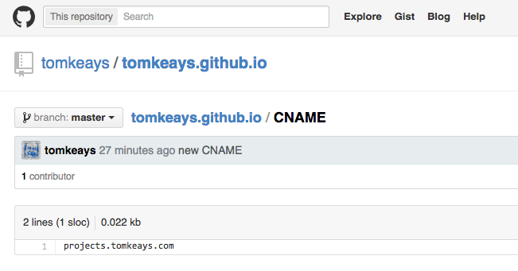
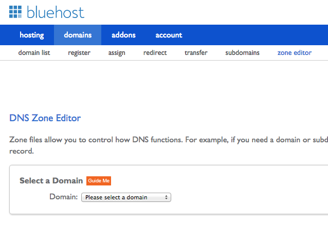

# Setting up projects.tomkeays.com

**Goal**: to have the URL [http://projects.tomkeays.com](projects.tomkeays.com) point to my [https://github.com/tomkeays/tomkeays.github.io](github.com/tomkeays/tomkeays.github.io) GitHub Pages repo.

The [GitHub Pages documentation](https://pages.github.com/) is actually quite good, but I decided I should write down more specifically what I had to do to set it up with my host.

## 1. Create a CNAME file

The CNAME file, in my case, needed to point to [http://projects.tomkeays.com](projects.tomkeays.com). When I was ready, I added it to my [github.com/tomkeays/tomkeays.github.io](https://github.com/tomkeays/tomkeays.github.io) GitHub Pages repo. That part took effect immediately, such that going to my GitHub Pages URL, [http://tomkeays.github.io](tomkeays.github.io), immediately redirected me to [http://projects.tomkeays.com](projects.tomkeays.com). Bluehost reported there was no such server because, at this point, there wasn’t. 

## 2. Create DNS record in Bluehost

Now I had to create a corresponding DNS record with my web hosting provider that represented the content being hosted in my GitHub Pages. 

- Using cPanel in Bluehost, select **domains** and then **zone editor**. 
- In my case, I selected the domain ‘tomkeays.com’ from the drop down menu. 

- In the “**Add DNS Record**” section, I filled out the “**Host Record**” as “**projects**”, since the destination was going to be ‘projects.tomkeays.com’. 
- The “**Type**” was set to “**CNAME**” — rather than “**A**” (“alias”) — since I’m not replacing the entire ‘tomkeays.com’ domain with GitHub Pages, just the ‘projects’ subdomain. 
- The “**Points To**” contains “**tomkeays.github.io**” where my GitHub Pages were served from before I added the CNAME file to the repo.  

- **Note:** You should not create a new subdomain in Bluehost from the **domains > subdomains** cPanel option. You only use that option when you are creating a subdomain that will be served out of a directory in your Bluehost account. 

- Once you click the “**Add Record**” button, the new CNAME will appear in the list. 

- It takes a few minutes (up to 4 hours) for the new alias to propagate across the DNS server network. You can check the status of the CNAME request by typing this command in the terminal. 

    dig projects.tomkeays.com +nostats +nocomments +nocmd

